# Architecture Documentation: .NET → React + Node/TypeScript

**Document Version**: 1.0  
**Date**: December 31, 2025  
**Status**: Active Planning

---

## Overview

This document provides architecture diagrams for the Contoso University application migration from .NET/Razor Pages to React + Node.js/TypeScript. It includes:

1. Current .NET architecture (AS-IS)
2. Target React/Node architecture (TO-BE)
3. Request flow mapping (legacy → target)
4. Data model mapping
5. Component hierarchy (frontend)

---

## 1. Current .NET Architecture (AS-IS)

### 1.1 Overall System Architecture

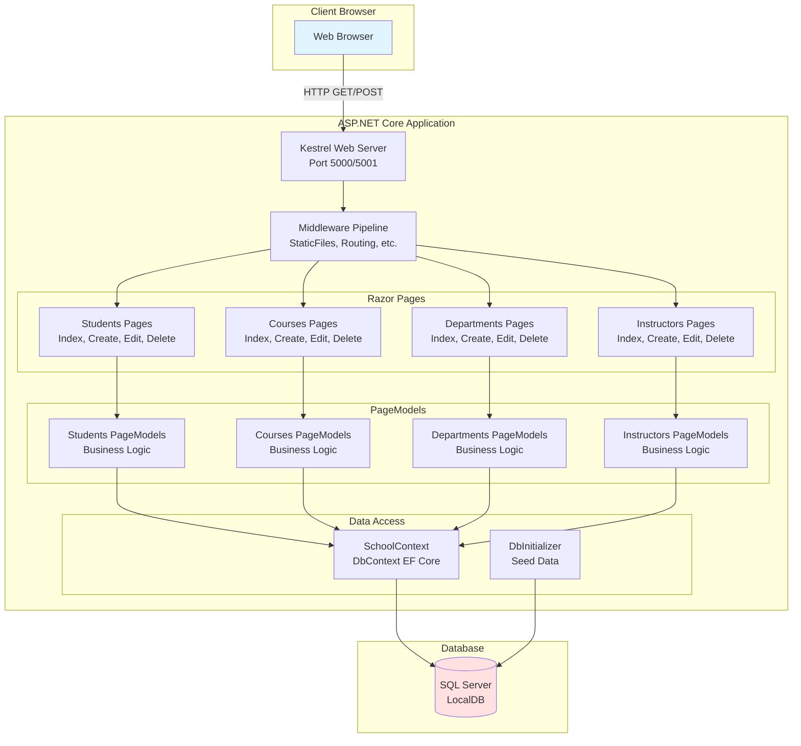

### 1.2 Current Data Model (EF Core)

```mermaid
erDiagram
    Student ||--o{ Enrollment : "has"
    Course ||--o{ Enrollment : "has"
    Course }o--|| Department : "belongs to"
    Instructor ||--o| OfficeAssignment : "has"
    Instructor ||--o{ Course : "teaches"
    Instructor ||--o| Department : "administers"

    Student {
        int ID PK
        string LastName
        string FirstMidName
        DateTime EnrollmentDate
    }

    Course {
        int CourseID PK "Manual entry, not auto-increment"
        string Title
        int Credits
        int DepartmentID FK
    }

    Enrollment {
        int EnrollmentID PK
        int CourseID FK
        int StudentID FK
        string Grade "Nullable enum: A, B, C, D, F"
    }

    Department {
        int DepartmentID PK
        string Name
        decimal Budget
        DateTime StartDate
        int InstructorID FK "Nullable"
        byte[] ConcurrencyToken "Timestamp for optimistic locking"
    }

    Instructor {
        int ID PK
        string LastName
        string FirstMidName
        DateTime HireDate
    }

    OfficeAssignment {
        int InstructorID PK_FK "Shared primary key"
        string Location
    }
```

### 1.3 Current Request Flow (Razor Pages)

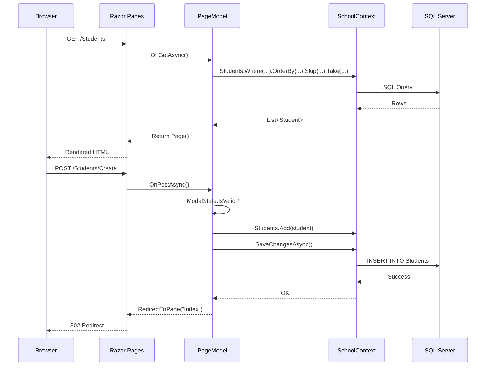

---

## 2. Target React/Node Architecture (TO-BE)

### 2.1 Overall System Architecture

```mermaid
graph TB
    subgraph "Client Browser"
        ReactApp[React SPA<br/>TypeScript + Redux]
    end

    subgraph "Backend API contoso-api"
        Express[Express Server<br/>Port 5000]

        subgraph "Middleware"
            CORS[CORS Middleware]
            AuthMiddleware[JWT Auth Middleware]
            ErrorHandler[Error Handler]
            Logger[Pino Logger]
        end

        subgraph "Routes"
            AuthRoutes[/api/auth]
            StudentRoutes[/api/students]
            CourseRoutes[/api/courses]
            DepartmentRoutes[/api/departments]
            InstructorRoutes[/api/instructors]
            HealthRoutes[/api/health]
        end

        subgraph "Controllers"
            StudentController[StudentController]
            CourseController[CourseController]
            DepartmentController[DepartmentController]
            InstructorController[InstructorController]
            AuthController[AuthController]
        end

        subgraph "Services"
            StudentService[StudentService]
            CourseService[CourseService]
            DepartmentService[DepartmentService]
            InstructorService[InstructorService]
            AuthService[AuthService]
        end

        subgraph "Data Access"
            DrizzleDB[Drizzle DB<br/>ORM]
            SeedScript[seed.ts<br/>Data Seeding]
        end
    end

    subgraph "Database"
        SQLite[(SQLite Database<br/>WAL Mode)]
    end

    ReactApp -->|HTTPS REST API| Express
    Express --> CORS
    CORS --> AuthMiddleware
    AuthMiddleware --> Logger
    Logger --> AuthRoutes
    Logger --> StudentRoutes
    Logger --> CourseRoutes
    Logger --> DepartmentRoutes
    Logger --> InstructorRoutes
    Logger --> HealthRoutes

    AuthRoutes --> AuthController
    StudentRoutes --> StudentController
    CourseRoutes --> CourseController
    DepartmentRoutes --> DepartmentController
    InstructorRoutes --> InstructorController

    AuthController --> AuthService
    StudentController --> StudentService
    CourseController --> CourseService
    DepartmentController --> DepartmentService
    InstructorController --> InstructorService

    AuthService --> DrizzleDB
    StudentService --> DrizzleDB
    CourseService --> DrizzleDB
    DepartmentService --> DrizzleDB
    InstructorService --> DrizzleDB

    DrizzleDB --> SQLite
    SeedScript --> SQLite

    ErrorHandler --> Express

    style ReactApp fill:#61dafb
    style SQLite fill:#ffe1e1
```

### 2.2 Target Data Model (Drizzle ORM)

```mermaid
erDiagram
    Student ||--o{ Enrollment : "has"
    Course ||--o{ Enrollment : "has"
    Course }o--|| Department : "belongs to"
    Instructor ||--o| OfficeAssignment : "has"
    Instructor ||--o{ Course : "teaches (implicit join table)"
    Instructor ||--o| Department : "administers"

    Student {
        Int ID PK "autoincrement"
        String LastName
        String FirstMidName
        DateTime EnrollmentDate
    }

    Course {
        Int CourseID PK "Manual entry, NOT autoincrement"
        String Title
        Int Credits
        Int DepartmentID FK
    }

    Enrollment {
        Int EnrollmentID PK "autoincrement"
        Int CourseID FK
        Int StudentID FK
        String Grade "Nullable: A, B, C, D, F"
    }

    Department {
        Int DepartmentID PK "autoincrement"
        String Name
        Decimal Budget
        DateTime StartDate
        Int InstructorID FK "Nullable"
        Int version "Optimistic locking version field"
    }

    Instructor {
        Int ID PK "autoincrement"
        String LastName
        String FirstMidName
        DateTime HireDate
    }

    OfficeAssignment {
        Int InstructorID PK_FK "Shared primary key"
        String Location
    }
```

**Key Changes**:

- **Department.ConcurrencyToken** (SQL Server `ROWVERSION`) → **Department.version** (Int field, manually incremented)
- **Instructor-Course many-to-many**: EF Core explicit `InstructorCourse` table → Drizzle ORM explicit join table (e.g., `InstructorCourse`)

### 2.3 Target Request Flow (React + Express)

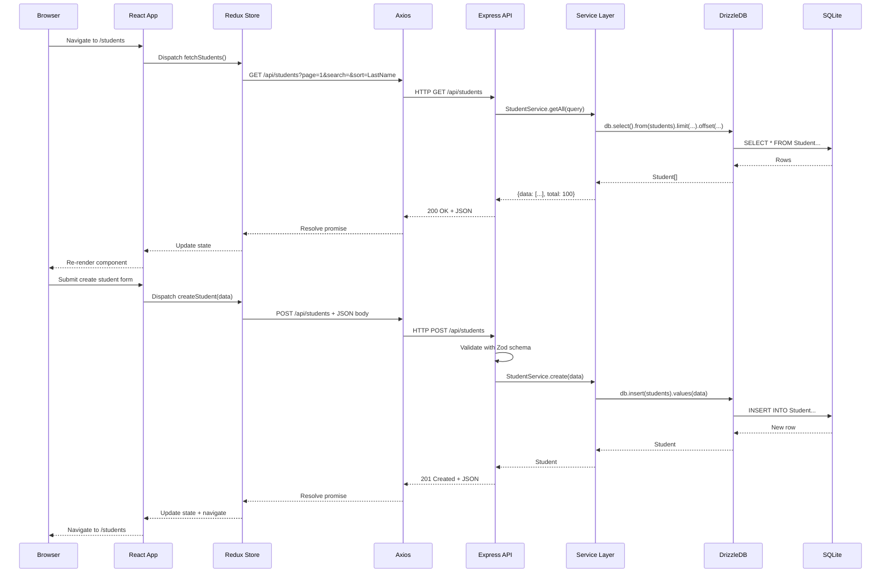

---

## 3. Request Flow Mapping (Legacy → Target)

### 3.1 Endpoint Parity Mapping

| .NET Razor Page                      | HTTP Method | Target Express Endpoint                                             | Controller Method                        | Notes                             |
| ------------------------------------ | ----------- | ------------------------------------------------------------------- | ---------------------------------------- | --------------------------------- |
| `/Students`                          | GET         | `/api/students?page=1&search=&sort=`                                | `StudentController.getAll()`             | Returns JSON, not HTML            |
| `/Students/Details/{id}`             | GET         | `/api/students/{id}`                                                | `StudentController.getById(id)`          | Includes enrollments              |
| `/Students/Create` (form)            | GET         | N/A                                                                 | N/A                                      | React form rendered client-side   |
| `/Students/Create` (submit)          | POST        | `/api/students`                                                     | `StudentController.create()`             | Returns JSON, not redirect        |
| `/Students/Edit/{id}` (form)         | GET         | `/api/students/{id}`                                                | `StudentController.getById(id)`          | React form fetches data           |
| `/Students/Edit/{id}` (submit)       | POST        | `/api/students/{id}` (PUT)                                          | `StudentController.update(id)`           | RESTful PUT, returns JSON         |
| `/Students/Delete/{id}` (confirm)    | GET         | `/api/students/{id}`                                                | `StudentController.getById(id)`          | React confirm dialog              |
| `/Students/Delete/{id}` (submit)     | POST        | `/api/students/{id}` (DELETE)                                       | `StudentController.delete(id)`           | RESTful DELETE                    |
| `/Courses`                           | GET         | `/api/courses`                                                      | `CourseController.getAll()`              | Includes department               |
| `/Courses/Details/{id}`              | GET         | `/api/courses/{id}`                                                 | `CourseController.getById(id)`           | Includes department               |
| `/Courses/Create` (form)             | GET         | `/api/departments`                                                  | `DepartmentController.getAll()`          | Fetch departments for dropdown    |
| `/Courses/Create` (submit)           | POST        | `/api/courses`                                                      | `CourseController.create()`              | Manual CourseID validation        |
| `/Courses/Edit/{id}` (form)          | GET         | `/api/courses/{id}`                                                 | `CourseController.getById(id)`           | CourseID immutable                |
| `/Courses/Edit/{id}` (submit)        | POST        | `/api/courses/{id}` (PUT)                                           | `CourseController.update(id)`            | CourseID not editable             |
| `/Courses/Delete/{id}` (confirm)     | GET         | `/api/courses/{id}`                                                 | `CourseController.getById(id)`           | Confirm dialog                    |
| `/Courses/Delete/{id}` (submit)      | POST        | `/api/courses/{id}` (DELETE)                                        | `CourseController.delete(id)`            | Cascade to enrollments            |
| `/Departments`                       | GET         | `/api/departments`                                                  | `DepartmentController.getAll()`          | Includes administrator            |
| `/Departments/Details/{id}`          | GET         | `/api/departments/{id}`                                             | `DepartmentController.getById(id)`       | Includes courses                  |
| `/Departments/Create` (form)         | GET         | `/api/instructors`                                                  | `InstructorController.getAll()`          | Fetch instructors for dropdown    |
| `/Departments/Create` (submit)       | POST        | `/api/departments`                                                  | `DepartmentController.create()`          | Initialize version=1              |
| `/Departments/Edit/{id}` (form)      | GET         | `/api/departments/{id}`                                             | `DepartmentController.getById(id)`       | Return current version            |
| `/Departments/Edit/{id}` (submit)    | POST        | `/api/departments/{id}` (PUT)                                       | `DepartmentController.update(id)`        | Check version, increment if match |
| `/Departments/Delete/{id}` (confirm) | GET         | `/api/departments/{id}`                                             | `DepartmentController.getById(id)`       | Confirm dialog                    |
| `/Departments/Delete/{id}` (submit)  | POST        | `/api/departments/{id}` (DELETE)                                    | `DepartmentController.delete(id)`        | Check version before delete       |
| `/Instructors?id=1&courseID=2`       | GET         | `/api/instructors?includeOffice=true&includeCourses=true`           | `InstructorController.getAll()`          | Master-detail in React UI         |
| `/Instructors/{id}`                  | GET         | `/api/instructors/{id}?includeCourses=true&includeEnrollments=true` | `InstructorController.getById(id)`       | Multiple levels of include        |
| `/Instructors/Details/{id}`          | GET         | `/api/instructors/{id}`                                             | `InstructorController.getById(id)`       | Full details                      |
| `/Instructors/Create` (form)         | GET         | `/api/courses`                                                      | `CourseController.getAll()`              | Fetch courses for checkboxes      |
| `/Instructors/Create` (submit)       | POST        | `/api/instructors`                                                  | `InstructorController.create()`          | Create with course assignments    |
| `/Instructors/Edit/{id}` (form)      | GET         | `/api/instructors/{id}?includeCourses=true`                         | `InstructorController.getById(id)`       | Fetch with current assignments    |
| `/Instructors/Edit/{id}` (submit)    | POST        | `/api/instructors/{id}` (PUT)                                       | `InstructorController.update(id)`        | Update with course assignments    |
| `/Instructors/Delete/{id}` (confirm) | GET         | `/api/instructors/{id}`                                             | `InstructorController.getById(id)`       | Confirm dialog                    |
| `/Instructors/Delete/{id}` (submit)  | POST        | `/api/instructors/{id}` (DELETE)                                    | `InstructorController.delete(id)`        | FK check (Department admin)       |
| `/About`                             | GET         | `/api/students/enrollment-stats`                                    | `StudentController.getEnrollmentStats()` | Group by enrollment date          |
| `/` (Home)                           | GET         | N/A                                                                 | N/A                                      | React home page (static)          |
| `/Privacy`                           | GET         | N/A                                                                 | N/A                                      | React privacy page (static)       |
| N/A                                  | POST        | `/api/auth/login`                                                   | `AuthController.login()`                 | **New**: JWT login                |
| N/A                                  | POST        | `/api/auth/logout`                                                  | `AuthController.logout()`                | **New**: JWT logout               |
| N/A                                  | POST        | `/api/auth/refresh`                                                 | `AuthController.refresh()`               | **New**: Token refresh            |
| N/A                                  | GET         | `/api/health`                                                       | `HealthController.check()`               | **New**: Health check             |

**Key Changes**:

- .NET Razor Pages return **HTML**; Express API returns **JSON**
- .NET uses **POST** for updates/deletes; Express uses **PUT/DELETE** (RESTful)
- React forms are **client-side**; no separate GET for form rendering
- **Concurrency conflicts** return 409 Conflict instead of rendering error page

---

## 4. Component Hierarchy (Frontend React)

### 4.1 React Component Tree

```mermaid
graph TD
    App[App.tsx<br/>Root Component]

    App --> Layout[Layout.tsx<br/>Bootstrap Navbar + Footer]

    Layout --> HomePage[HomePage.tsx<br/>Landing Page]
    Layout --> AboutPage[AboutPage.tsx<br/>Enrollment Stats]
    Layout --> PrivacyPage[PrivacyPage.tsx<br/>Privacy Policy]
    Layout --> NotFoundPage[NotFoundPage.tsx<br/>404 Error]

    Layout --> StudentsModule[Students Module]
    Layout --> CoursesModule[Courses Module]
    Layout --> DepartmentsModule[Departments Module]
    Layout --> InstructorsModule[Instructors Module]
    Layout --> AuthModule[Auth Module]

    StudentsModule --> StudentListPage[StudentListPage.tsx<br/>Index with pagination]
    StudentsModule --> StudentDetailsPage[StudentDetailsPage.tsx<br/>View student]
    StudentsModule --> StudentCreatePage[StudentCreatePage.tsx<br/>Create form]
    StudentsModule --> StudentEditPage[StudentEditPage.tsx<br/>Edit form]

    StudentListPage --> SearchBar[SearchBar.tsx]
    StudentListPage --> SortDropdown[SortDropdown.tsx]
    StudentListPage --> Pagination[Pagination.tsx]
    StudentListPage --> StudentTable[StudentTable.tsx]

    StudentCreatePage --> StudentForm[StudentForm.tsx<br/>Reusable form]
    StudentEditPage --> StudentForm

    CoursesModule --> CourseListPage[CourseListPage.tsx]
    CoursesModule --> CourseDetailsPage[CourseDetailsPage.tsx]
    CoursesModule --> CourseCreatePage[CourseCreatePage.tsx]
    CoursesModule --> CourseEditPage[CourseEditPage.tsx]

    CourseCreatePage --> CourseForm[CourseForm.tsx<br/>Reusable form]
    CourseEditPage --> CourseForm

    DepartmentsModule --> DepartmentListPage[DepartmentListPage.tsx]
    DepartmentsModule --> DepartmentDetailsPage[DepartmentDetailsPage.tsx]
    DepartmentsModule --> DepartmentCreatePage[DepartmentCreatePage.tsx]
    DepartmentsModule --> DepartmentEditPage[DepartmentEditPage.tsx]

    DepartmentEditPage --> ConcurrencyConflictModal[ConcurrencyConflictModal.tsx<br/>Conflict resolution UI]

    InstructorsModule --> InstructorListPage[InstructorListPage.tsx<br/>Master-detail view]
    InstructorsModule --> InstructorDetailsPage[InstructorDetailsPage.tsx]
    InstructorsModule --> InstructorCreatePage[InstructorCreatePage.tsx]
    InstructorsModule --> InstructorEditPage[InstructorEditPage.tsx]

    InstructorCreatePage --> InstructorForm[InstructorForm.tsx<br/>With course checkboxes]
    InstructorEditPage --> InstructorForm

    AuthModule --> LoginPage[LoginPage.tsx<br/>Login form]
    AuthModule --> LogoutButton[LogoutButton.tsx]

    style App fill:#61dafb
    style Layout fill:#ffd700
```

### 4.2 Redux Store Structure

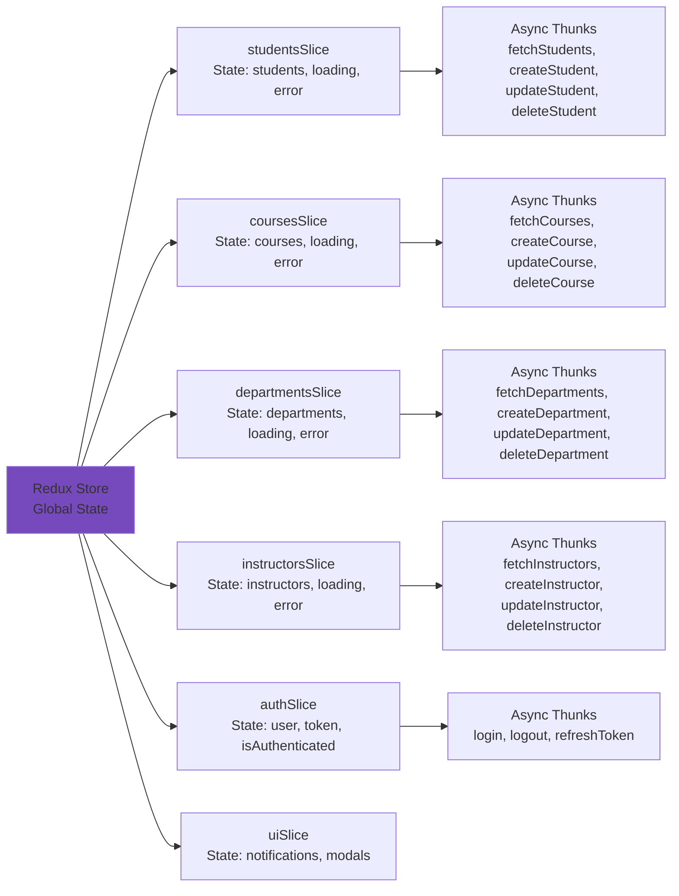

---

## 5. Authentication Flow (JWT)

### 5.1 JWT Authentication Sequence

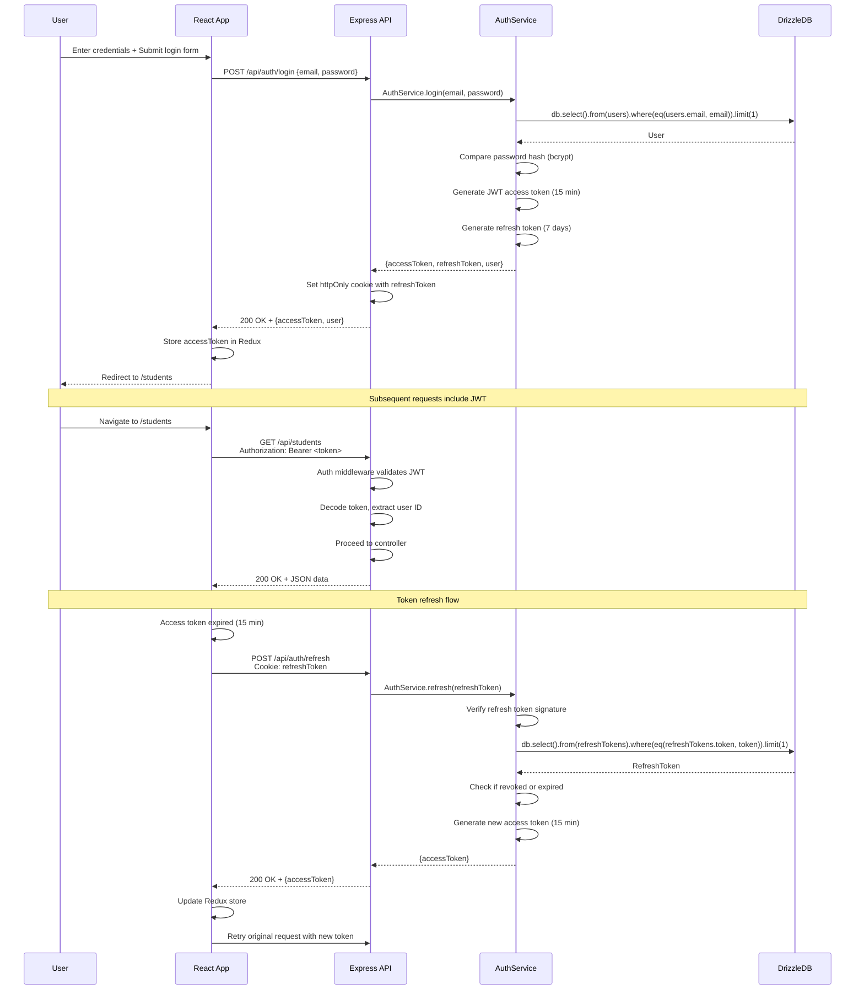

---

## 6. Data Migration Flow

### 6.1 SQL Server → SQLite Migration

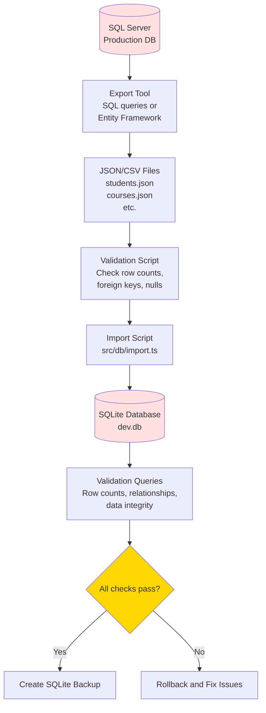

---

## 7. Deployment Architecture

### 7.1 Production Deployment (Azure Example)

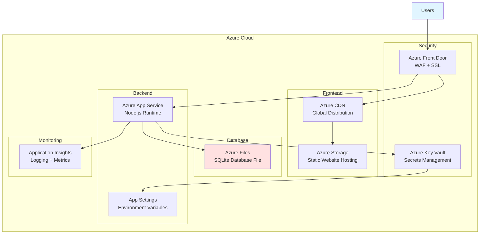

### 7.2 CI/CD Pipeline (Conceptual)

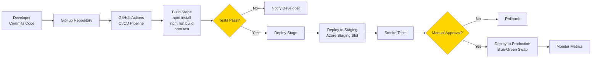

---

## 8. Error Handling and Logging Architecture

### 8.1 Error Flow

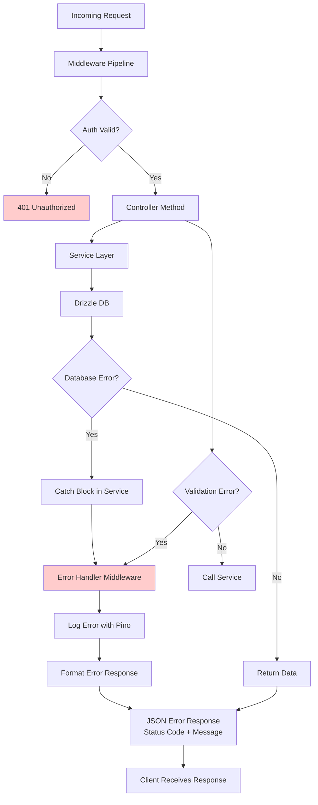

---

## 9. Concurrency Control Architecture

### 9.1 Department Optimistic Locking Flow

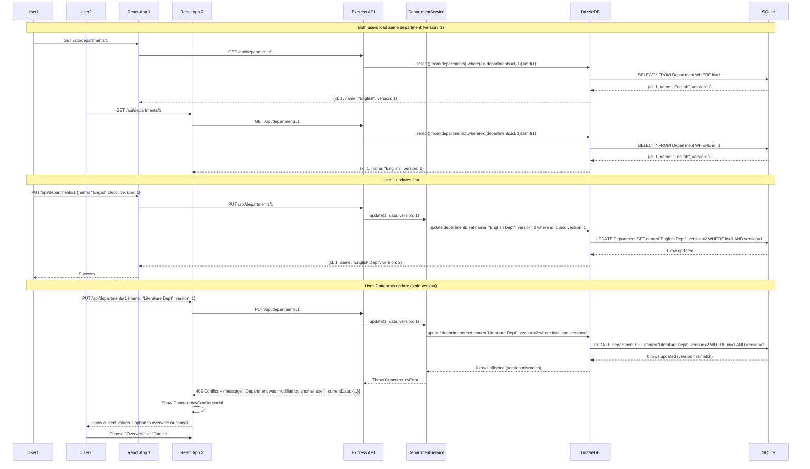

---

## Summary

This architecture documentation provides:

1. **Current State**: .NET Razor Pages architecture with EF Core and SQL Server
2. **Target State**: React SPA + Express API + Drizzle ORM + SQLite
3. **Mapping**: Detailed endpoint and component mapping
4. **Flows**: Authentication, data migration, deployment, error handling, concurrency
5. **Diagrams**: Mermaid diagrams for all major architectural components

**Key Architectural Changes**:

- **Monolithic Razor Pages → Decoupled SPA + API**
- **Server-side rendering → Client-side rendering with API calls**
- **HTML responses → JSON responses**
- **SQL Server → SQLite**
- **EF Core → Drizzle ORM**
- **No authentication → JWT-based authentication**
- **ROWVERSION concurrency → Version field concurrency**

**Next Steps**:

1. Review architecture diagrams with team
2. Validate Mermaid syntax renders correctly
3. Use diagrams as reference during implementation
4. Update diagrams as architecture evolves

---

**Document Status**: Draft - Ready for Review  
**Mermaid Version**: Validated with Mermaid Live Editor  
**Last Updated**: December 31, 2025
