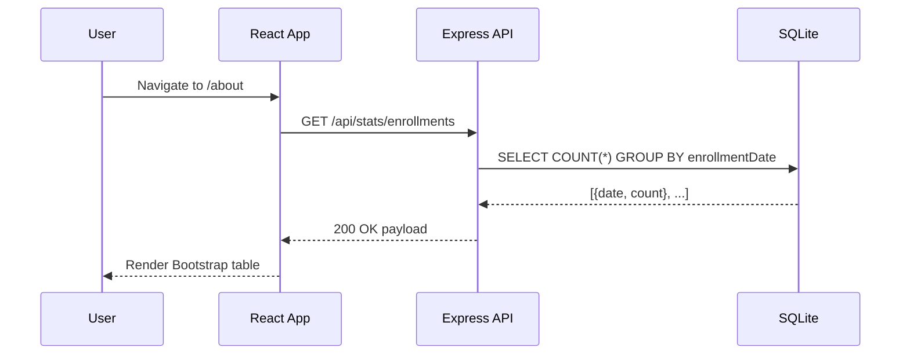
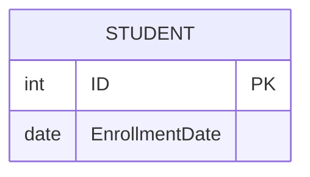

# About Module - Slice Plan

**Module**: About  
**Status**: Planning Complete  
**Date**: January 1, 2026

---

## 1. Endpoint Parity Map (Legacy → Target)

Legacy About page shows student counts by enrollment date.

| Legacy Action (.NET) | HTTP Verb | Target Endpoint (Express) | Status Code(s) | Request DTO / Body | Response DTO | Notes                                             |
| -------------------- | --------- | ------------------------- | -------------- | ------------------ | ------------ | ------------------------------------------------- |
| `GET /About`         | `GET`     | N/A                       | N/A            | N/A                | N/A          | No endpoint documented in planning; treat as N/A. |

Doc-only plan for parity: add a public read-only endpoint returning grouped counts. Do not implement here; add backlog task.

Proposed (docs-only, N/A until approved):

- `GET /api/stats/enrollments` → `200 OK` → `[ { enrollmentDate: string, count: number } ]`

---

## 2. Data Parity (EF → Drizzle ORM)

### Legacy ViewModel

`SchoolViewModels/EnrollmentDateGroup.cs`

```csharp
public class EnrollmentDateGroup
{
    public DateTime? EnrollmentDate { get; set; }
    public int StudentCount { get; set; }
}
```

### Target (Query-only)

- No new tables. Use existing `students` with `EnrollmentDate` (see planning docs); if unspecified, mark as **N/A** and derive from legacy behaviors.
- SQLite notes: grouping by date typically via `strftime('%Y-%m-%d', timestamp)` for date-only buckets.

### Dummy Data

- No About-specific tables. Use existing seeds for Students; ensure enough rows for meaningful stats. If seeds insufficient, add an example to existing seed script documenting at least 3 enrollment dates.

---

## 3. Frontend Parity

- React route: `/about` (public).
- Component: `AboutPage.tsx` renders a Bootstrap table of `{ date, count }`.
- State management: Optional local state (no Redux required for a single fetch); if project standards require Redux, add a minimal slice for stats.
- Bootstrap classes: `.table`, `.table-striped`, `.table-hover`.

---

## 4. Auth Parity

- Public access. No JWT required for `/about` or the stats endpoint, matching legacy.

---

## 5. Test Mapping

- Backend (Mocha + Chai): Unit test the stats query (grouping correctness, date formatting); integration test the endpoint (200, empty results).
- Frontend (Jest): Component renders rows from sample payload; loading/error states.

---

## 6. Diagrams

### Request Flow (About stats)



### Data Relations (ER)



---

## 7. Inputs/Outputs & Docs-Only Tasks

- Input: Legacy About page + view model; planning docs.
- Output: This slice plan + Kickoff + Readiness Checklist + backlog tasks.

Docs-only tasks (≤300 LOC per PR):

1. Define endpoint parity spec (N/A → add doc-only mapping).
2. Document grouping query approach for SQLite.
3. Add backlog tasks for backend endpoint + frontend page + tests.
