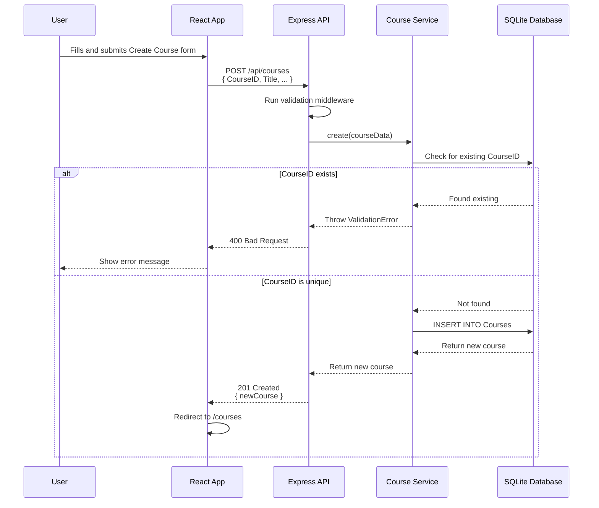
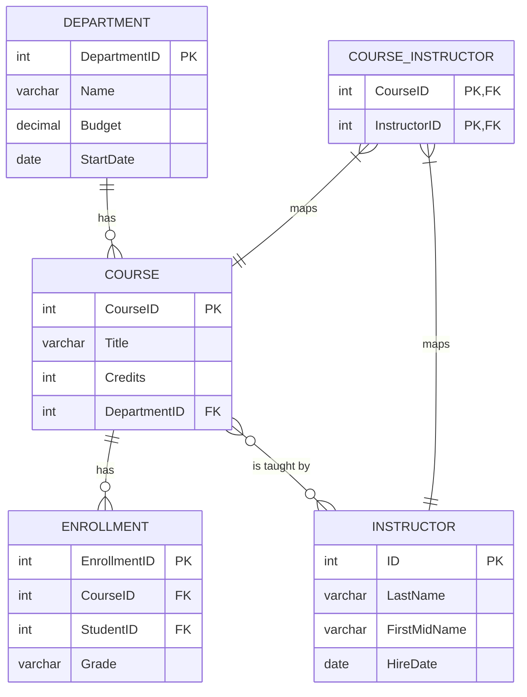

# Courses Module - Slice Plan

**Module**: Courses  
**Status**: Planning Complete  
**Date**: January 1, 2026

---

## 1. Endpoint Parity Map

This table maps legacy ASP.NET Razor Page actions to the target Node.js/Express endpoints.

| Legacy Action (.NET)        | HTTP Verb | Target Endpoint (Express) | Status Code(s) | Request DTO / Body                           | Response DTO          | Notes                                   |
| --------------------------- | --------- | ------------------------- | -------------- | -------------------------------------------- | --------------------- | --------------------------------------- |
| `GET /Courses/Index`        | `GET`     | `/api/courses`            | 200            | N/A                                          | `Course[]`            | Returns all courses; no pagination.     |
| `GET /Courses/Details/{id}` | `GET`     | `/api/courses/{id}`       | 200, 404       | N/A                                          | `Course`              |                                         |
| `GET /Courses/Create`       | `GET`     | `/api/departments`        | 200            | N/A                                          | `Department[]`        | For populating the department dropdown. |
| `POST /Courses/Create`      | `POST`    | `/api/courses`            | 201, 400       | `{ CourseID, Title, Credits, DepartmentID }` | `Course`              | `CourseID` is manually assigned.        |
| `GET /Courses/Edit/{id}`    | `GET`     | `/api/courses/{id}`       | 200, 404       | N/A                                          | `Course`              | Fetches data to populate the edit form. |
| `POST /Courses/Edit/{id}`   | `PUT`     | `/api/courses/{id}`       | 200, 400, 404  | `{ Title, Credits, DepartmentID }`           | `Course`              | `CourseID` is immutable.                |
| `GET /Courses/Delete/{id}`  | `GET`     | `/api/courses/{id}`       | 200, 404       | N/A                                          | `Course`              | Fetches data for the confirmation page. |
| `POST /Courses/Delete/{id}` | `DELETE`  | `/api/courses/{id}`       | 200, 404       | N/A                                          | `{ message: string }` |                                         |

---

## 2. Data Parity

### EF Core Entity → Drizzle ORM Schema

The `Course` entity from Entity Framework is mapped to the Drizzle ORM schema with strict parity.

**Legacy: `ContosoUniversity/Models/Course.cs`**

```csharp
public class Course
{
    [DatabaseGenerated(DatabaseGeneratedOption.None)]
    public int CourseID { get; set; }

    [StringLength(50, MinimumLength = 3)]
    public string Title { get; set; }

    [Range(0, 5)]
    public int Credits { get; set; }

    public int DepartmentID { get; set; }
    public Department Department { get; set; }
    public ICollection<Enrollment> Enrollments { get; set; }
    public ICollection<Instructor> Instructors { get; set; }
}
```

**Target: `contoso/src/db/schema.ts`**

```typescript
export const courses = sqliteTable('Courses', {
  CourseID: integer('CourseID').primaryKey(), // Manual entry, no autoincrement
  Title: text('Title').notNull(), // Should be notNull
  Credits: integer('Credits').notNull(),
  DepartmentID: integer('DepartmentID')
    .notNull()
    .references(() => departments.DepartmentID, { onDelete: 'cascade' }),
});

export const coursesRelations = relations(courses, ({ one, many }) => ({
  department: one(departments, {
    fields: [courses.DepartmentID],
    references: [departments.DepartmentID],
  }),
  enrollments: many(enrollments),
  instructors: many(courseInstructors),
}));
```

**Parity Notes**:

- ✅ **Manual `CourseID`**: The `primaryKey()` in Drizzle without `autoincrement` correctly mirrors `DatabaseGeneratedOption.None`.
- ⚠️ **Validation**: The `[StringLength(50, MinimumLength = 3)]` and `[Range(0, 5)]` attributes are enforced in the backend's validation middleware (`contoso/src/middleware/validation.ts`), not at the schema level. The title validation must be corrected from 1-100 chars to 3-50.
- ✅ **Relationships**: All relationships (Department, Enrollments, Instructors) are correctly modeled with relations and a join table (`courseInstructors`).

### Dummy Data Seeding

After schema creation, dummy data for courses will be added using a Drizzle seed script. This step should run after departments have been seeded.

**File**: `contoso/drizzle/seed.ts`

```typescript
// ... inside the seed function, after departments are created

console.log('Seeding courses...');
await db.insert(courses).values([
  { CourseID: 1050, Title: 'Chemistry', Credits: 3, DepartmentID: 3 },
  { CourseID: 4022, Title: 'Microeconomics', Credits: 3, DepartmentID: 4 },
  { CourseID: 4041, Title: 'Macroeconomics', Credits: 3, DepartmentID: 4 },
  { CourseID: 1045, Title: 'Calculus', Credits: 4, DepartmentID: 1 },
  { CourseID: 3141, Title: 'Trigonometry', Credits: 4, DepartmentID: 1 },
  { CourseID: 2021, Title: 'Composition', Credits: 3, DepartmentID: 2 },
  { CourseID: 2042, Title: 'Literature', Credits: 4, DepartmentID: 2 },
]);
```

---

## 3. Frontend Parity

### Razor Views → React Routes & Components

| Legacy View (Razor)            | Target Route (React)  | Target Component         | Notes                                    |
| ------------------------------ | --------------------- | ------------------------ | ---------------------------------------- |
| `Pages/Courses/Index.cshtml`   | `/courses`            | `StudentListPage.tsx`    | Displays a table of all courses.         |
| `Pages/Courses/Details.cshtml` | `/courses/:id`        | `StudentDetailsPage.tsx` | Shows details for a single course.       |
| `Pages/Courses/Create.cshtml`  | `/courses/create`     | `StudentCreatePage.tsx`  | Form for creating a new course.          |
| `Pages/Courses/Edit.cshtml`    | `/courses/:id/edit`   | `StudentEditPage.tsx`    | Form for editing an existing course.     |
| `Pages/Courses/Delete.cshtml`  | `/courses/:id/delete` | `StudentDeletePage.tsx`  | Confirmation page for deleting a course. |

### Redux Toolkit State

A new `coursesSlice.ts` will be created to manage the state for the Courses module, mirroring the existing `studentsSlice.ts`.

**File**: `contoso/client/src/store/slices/coursesSlice.ts`

```typescript
interface CourseState {
  courses: Course[];
  currentCourse: Course | null;
  loading: boolean;
  error: string | null;
}

const initialState: CourseState = {
  courses: [],
  currentCourse: null,
  loading: false,
  error: null,
};

// Thunks to be created:
// - fetchCourses
// - fetchCourseById
// - createCourse
// - updateCourse
// - deleteCourse

const coursesSlice = createSlice({
  name: 'courses',
  initialState,
  reducers: {
    // ...reducers for handling state changes
  },
  extraReducers: (builder) => {
    // ...extra reducers for handling thunk lifecycle (pending, fulfilled, rejected)
  },
});
```

---

## 4. Auth Parity

- **Legacy**: The ContosoUniversity application has no authentication or authorization. All pages are public.
- **Target**: The `contoso-api` currently has no auth middleware applied to the course routes. This matches the legacy behavior.
- **Future**: JWT-based authentication will be added in a later phase, as documented in `Docs/planning/Security-Implementation-Summary.md`. For this module, all endpoints will remain public.

---

## 5. Test Mapping

| Legacy Testing           | Target Testing                              | Notes                                                                                                                                                                                                                                             |
| ------------------------ | ------------------------------------------- | ------------------------------------------------------------------------------------------------------------------------------------------------------------------------------------------------------------------------------------------------- |
| N/A (No automated tests) | **Backend (Mocha + Chai)**                  | - Unit tests for `courseService.ts` to verify business logic (manual `CourseID`, validation, etc.).<br>- Integration tests for `courseController.ts` to verify endpoint behavior, status codes, and DTOs.<br>- Tests for cascade delete behavior. |
| N/A (No automated tests) | **Frontend (Jest + React Testing Library)** | - Component tests for each of the 5 course pages.<br>- Form validation tests for create/edit pages.<br>- Redux slice and thunk tests.<br>- E2E tests for the full CRUD user flow.                                                                 |

---

## 6. Diagrams

### Request Flow Diagram (Create Course)



### Data Relations Diagram



---

## 7. Inputs/Outputs & Task Breakdown

This work will be delivered as documentation only. Future implementation pull requests should be small and focused (≤ 300 LOC).

- **Input**: Legacy `ContosoUniversity` source code, existing `contoso` backend.
- **Output**: This document and the associated `Kickoff.md` and `Readiness-Checklist.md`.

**Docs-Only Tasks**:

1.  **Task C-1**: Create `Kickoff.md` for the Courses module.
2.  **Task C-2**: Create this `Slice-Plan.md`.
3.  **Task C-3**: Create `Readiness-Checklist.md`.
4.  **Task C-4**: Update `Backlog.md` with implementation tasks for the Courses module.
