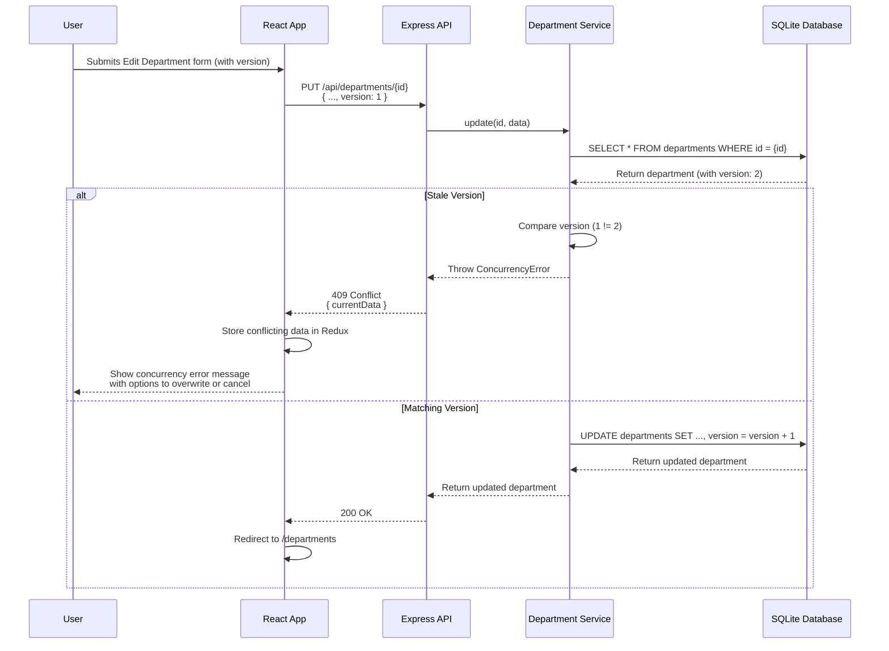

# Departments Module - Slice Plan

**Module**: Departments  
**Status**: Planning Complete  
**Date**: January 1, 2026

---

## 1. Endpoint Parity Map

| Legacy Action (.NET)            | HTTP Verb | Target Endpoint (Express) | Status Code(s)         | Request DTO / Body                                       | Response DTO          | Notes                               |
| ------------------------------- | --------- | ------------------------- | ---------------------- | -------------------------------------------------------- | --------------------- | ----------------------------------- |
| `GET /Departments/Index`        | `GET`     | `/api/departments`        | 200                    | N/A                                                      | `Department[]`        |                                     |
| `GET /Departments/Details/{id}` | `GET`     | `/api/departments/{id}`   | 200, 404               | N/A                                                      | `Department`          |                                     |
| `GET /Departments/Create`       | `GET`     | `/api/instructors`        | 200                    | N/A                                                      | `Instructor[]`        | For Administrator dropdown.         |
| `POST /Departments/Create`      | `POST`    | `/api/departments`        | 201, 400               | `{ Name, Budget, StartDate, InstructorID }`              | `Department`          |                                     |
| `GET /Departments/Edit/{id}`    | `GET`     | `/api/departments/{id}`   | 200, 404               | N/A                                                      | `Department`          | Fetches data for the edit form.     |
| `POST /Departments/Edit/{id}`   | `PUT`     | `/api/departments/{id}`   | 200, 400, 404, **409** | `{ Name, Budget, StartDate, InstructorID, **version** }` | `Department`          | Includes `version` for concurrency. |
| `GET /Departments/Delete/{id}`  | `GET`     | `/api/departments/{id}`   | 200, 404               | N/A                                                      | `Department`          | Fetches data for confirmation.      |
| `POST /Departments/Delete/{id}` | `DELETE`  | `/api/departments/{id}`   | 200, 404, **409**      | `{ **version** }`                                        | `{ message: string }` | Includes `version` for concurrency. |

---

## 2. Data Parity

### EF Core Entity → Drizzle ORM Schema

**Legacy: `ContosoUniversity/Models/Department.cs`**

```csharp
public class Department
{
    public int DepartmentID { get; set; }

    [StringLength(50, MinimumLength = 3)]
    public string Name { get; set; }

    [DataType(DataType.Currency)]
    [Column(TypeName = "money")]
    public decimal Budget { get; set; }

    [DataType(DataType.Date)]
    [DisplayFormat(DataFormatString = "{0:yyyy-MM-dd}", ApplyFormatInEditMode = true)]
    public DateTime StartDate { get; set; }

    public int? InstructorID { get; set; }

    [Timestamp]
    public byte[] RowVersion { get; set; }

    public Instructor Administrator { get; set; }
    public ICollection<Course> Courses { get; set; }
}
```

**Target: `contoso/src/db/schema.ts`**

```typescript
export const departments = sqliteTable('departments', {
  DepartmentID: integer('DepartmentID').primaryKey({ autoIncrement: true }),
  Name: text('Name', { length: 100 }),
  Budget: real('Budget').notNull().default(0),
  StartDate: integer('StartDate', { mode: 'timestamp' }),
  InstructorID: integer('InstructorID').references(() => instructors.ID),
  version: integer('version').notNull().default(0),
});
```

**Parity Notes**:

- ✅ **Primary Key**: `DepartmentID` is auto-incrementing, matching the legacy behavior.
- ✅ **Optimistic Concurrency**: The `[Timestamp]` `RowVersion` is mapped to a `version` integer field. The backend service manually increments this on each update.
- ✅ **Administrator**: The nullable `InstructorID` foreign key is correctly implemented.
- ⚠️ **Data Types**: `money` is mapped to `real` (floating-point) in SQLite. `DateTime` is mapped to an integer timestamp. This is an acceptable translation for SQLite.

### Dummy Data Seeding

**File**: `contoso/drizzle/seed.ts`

```typescript
// ... inside the seed function, after instructors are created

console.log('Seeding departments...');
await db.insert(departments).values([
  {
    Name: 'English',
    Budget: 350000,
    StartDate: new Date('2007-09-01'),
    InstructorID: 2,
  },
  {
    Name: 'Mathematics',
    Budget: 100000,
    StartDate: new Date('2007-09-01'),
    InstructorID: 3,
  },
  {
    Name: 'Engineering',
    Budget: 350000,
    StartDate: new Date('2007-09-01'),
    InstructorID: 4,
  },
  {
    Name: 'Economics',
    Budget: 100000,
    StartDate: new Date('2007-09-01'),
    InstructorID: 5,
  },
]);
```

---

## 3. Frontend Parity

### Razor Views → React Routes & Components

| Legacy View (Razor)                | Target Route (React)      | Target Component            | Notes                    |
| ---------------------------------- | ------------------------- | --------------------------- | ------------------------ |
| `Pages/Departments/Index.cshtml`   | `/departments`            | `DepartmentListPage.tsx`    |                          |
| `Pages/Departments/Details.cshtml` | `/departments/:id`        | `DepartmentDetailsPage.tsx` |                          |
| `Pages/Departments/Create.cshtml`  | `/departments/create`     | `DepartmentCreatePage.tsx`  |                          |
| `Pages/Departments/Edit.cshtml`    | `/departments/:id/edit`   | `DepartmentEditPage.tsx`    | Must handle concurrency. |
| `Pages/Departments/Delete.cshtml`  | `/departments/:id/delete` | `DepartmentDeletePage.tsx`  | Must handle concurrency. |

### Redux Toolkit State

A `departmentsSlice.ts` will be created.

**File**: `contoso/client/src/store/slices/departmentsSlice.ts`

```typescript
interface DepartmentState {
  departments: Department[];
  currentDepartment: Department | null;
  loading: boolean;
  error: string | null;
  // Field to hold server data during a concurrency conflict
  conflictingDepartment: Department | null;
}
// ... thunks and slice definition
```

---

## 4. Diagrams

### Request Flow Diagram (Update Department with Concurrency)



---

## 5. Task Breakdown

- **Input**: Legacy `ContosoUniversity` source code, existing `contoso` backend.
- **Output**: This document and associated `Kickoff.md` and `Readiness-Checklist.md`.

**Docs-Only Tasks**:

1.  **Task D-1**: Create `Kickoff.md` for the Departments module.
2.  **Task D-2**: Create this `Slice-Plan.md`.
3.  **Task D-3**: Create `Readiness-Checklist.md`.
4.  **Task D-4**: Update `Backlog.md` with implementation tasks.
