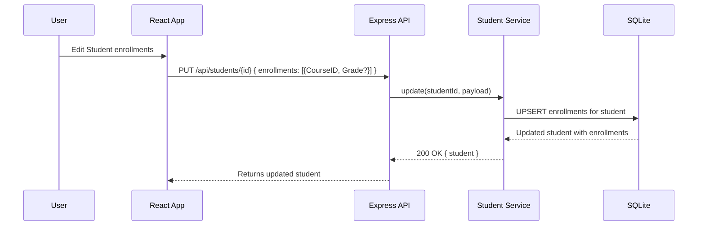

# Enrollments Module - Slice Plan

**Module**: Enrollments  
**Status**: Planning Complete  
**Date**: January 1, 2026

---

## 1. Endpoint Parity Map (Legacy → Target)

Legacy ContosoUniversity does not expose dedicated Enrollment controllers; enrollment changes occur within Student workflows.

| Legacy Action (.NET)               | HTTP Verb | Target Endpoint (Express) | Status Code(s) | Request DTO / Body                             | Response DTO | Notes                                       |
| ---------------------------------- | --------- | ------------------------- | -------------- | ---------------------------------------------- | ------------ | ------------------------------------------- |
| N/A (Enrollments via Student Edit) | `PUT`     | `/api/students/{id}`      | 200, 400, 404  | `{ ..., enrollments: [{ CourseID, Grade? }] }` | `Student`    | Enrollments managed inside student payload. |
| N/A (Remove enrollment)            | `PUT`     | `/api/students/{id}`      | 200, 400, 404  | `{ ..., enrollments: [...] }`                  | `Student`    | Removing rows mirrors legacy behavior.      |
| N/A (Direct enrollment endpoints)  | N/A       | N/A                       | N/A            | N/A                                            | N/A          | N/A per planning docs.                      |

If dedicated Enrollment endpoints are later documented, add strict parity entries; otherwise mark as **N/A**.

---

## 2. Data Parity (EF → Drizzle ORM)

### Legacy EF Model (reference)

```csharp
public enum Grade { A, B, C, D, F }

public class Enrollment
{
    public int EnrollmentID { get; set; }
    public int CourseID { get; set; }
    public int StudentID { get; set; }
    public Grade? Grade { get; set; }
    public Course Course { get; set; }
    public Student Student { get; set; }
}
```

### Target Drizzle ORM (SQLite)

- Table: `Enrollments`
- Columns:
  - `EnrollmentID`: integer primary key (auto-increment)
  - `CourseID`: integer not null, FK → `Courses.CourseID` (onDelete: cascade)
  - `StudentID`: integer not null, FK → `Students.ID` (onDelete: cascade)
  - `Grade`: text or integer nullable (store enum as text or int; follow existing schema). If planning docs do not specify, mark as **N/A** and keep nullable.
- Relations:
  - Many-to-one: Enrollment → Course
  - Many-to-one: Enrollment → Student
- Indices:
  - Optional composite index `(StudentID, CourseID)` for faster lookups (N/A if not in planning docs).

### SQLite Notes

- Enum storage: Use `TEXT` or `INTEGER` based on current schema; maintain nullability for `Grade`.
- Cascade deletes: Verified for both `CourseID` and `StudentID` FKs.

---

## 3. Dummy Data Seeding (Drizzle ORM)

After schema creation and seeding `Students` and `Courses`, insert example enrollments.

File: `contoso/drizzle/seed.ts`

```typescript
// ...existing code...
console.log('Seeding enrollments...');
await db.insert(enrollments).values([
  { CourseID: 1050, StudentID: 1, Grade: 'A' },
  { CourseID: 4022, StudentID: 2, Grade: 'B' },
  { CourseID: 4041, StudentID: 3, Grade: null },
]);
```

Ensure `Students` and `Courses` seeds run before enrollments.

---

## 4. Frontend Parity

- No dedicated Enrollment pages. Enrollment creation/edit/removal is part of Student pages (Create/Edit) with Bootstrap UI.
- Redux: Student slice should include enrollments array in state, mirroring view-models.
- Validation: Client-side form constraints align with legacy (N/A for direct enrollment forms).

---

## 5. Auth Parity

- Legacy pages are public. JWT N/A for this slice per [Security-Implementation-Summary.md](../../Security-Implementation-Summary.md). Preserve route access parity.

---

## 6. Test Mapping

- Legacy: N/A automated tests for Enrollment.
- Target:
  - Backend (Mocha + Chai):
    - Create enrollment via `PUT /api/students/{id}` updates with new row.
    - Remove enrollment reflected in student payload.
    - Cascade delete: deleting a Course or Student removes related enrollments.
  - Frontend (Jest):
    - Student Create/Edit components include enrollment data in thunks.
    - State selectors return enrollments correctly.

---

## 7. Diagrams

### Request Flow (Add Enrollment via Student Edit)



### Data Relations (ER)

```mermaid
erDiagram
    STUDENT {
        int ID PK
        varchar LastName
        varchar FirstName
    }
    COURSE {
        int CourseID PK
        varchar Title
    }
    ENROLLMENT {
        int EnrollmentID PK
        int StudentID FK
        int CourseID FK
        varchar Grade?
    }

    STUDENT ||--o{ ENROLLMENT : "has"
    COURSE  ||--o{ ENROLLMENT : "has"
```

---

## 8. Inputs/Outputs & Docs-Only Tasks

- Input: Legacy models/pages; current backend routes; planning docs.
- Output: This plan, Kickoff, Readiness, and Backlog updates.

Docs-only tasks (≤300 LOC per PR):

1. Document endpoint/data parity (this file).
2. Add seed steps (dummy enrollments).
3. Update Backlog with Enrollment tasks.
