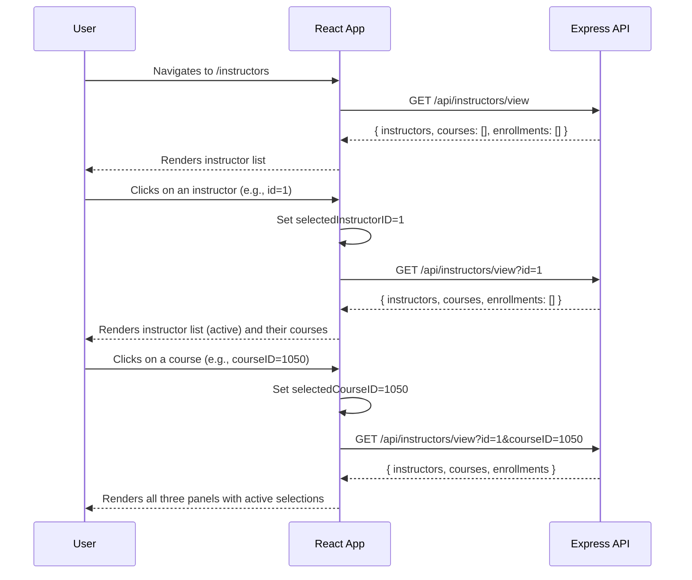
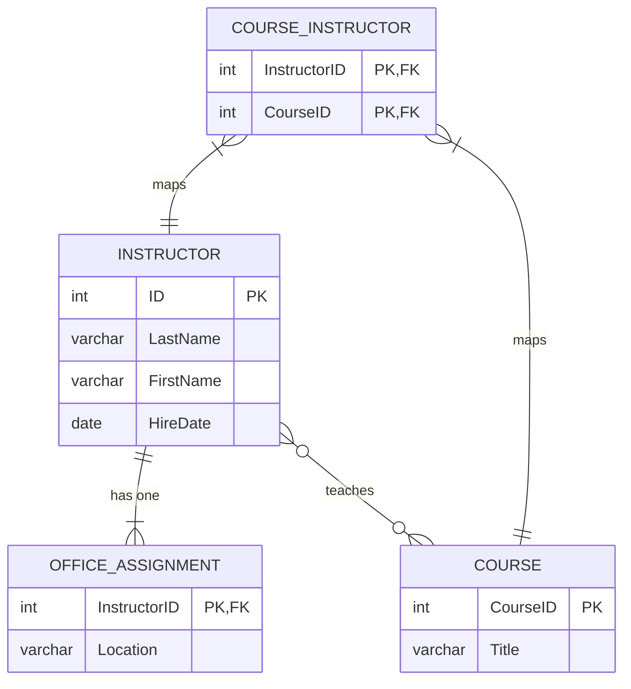

# Instructors Module - Slice Plan

**Module**: Instructors  
**Status**: Planning Complete  
**Date**: January 1, 2026

---

## 1. Endpoint Parity Map

| Legacy Action (.NET)            | HTTP Verb | Target Endpoint (Express) | Status Code(s) | Request DTO / Body                | Response DTO          | Notes                             |
| ------------------------------- | --------- | ------------------------- | -------------- | --------------------------------- | --------------------- | --------------------------------- |
| `GET /Instructors/Index`        | `GET`     | `/api/instructors/view`   | 200            | `?id={id}&courseID={courseID}`    | `InstructorIndexData` | A new view-specific endpoint.     |
| `GET /Instructors/Details/{id}` | `GET`     | `/api/instructors/{id}`   | 200, 404       | N/A                               | `Instructor`          |                                   |
| `GET /Instructors/Create`       | `GET`     | `/api/courses`            | 200            | N/A                               | `Course[]`            | For course assignment checkboxes. |
| `POST /Instructors/Create`      | `POST`    | `/api/instructors`        | 201, 400       | `{ instructor, office, courses }` | `Instructor`          | Complex body with nested objects. |
| `GET /Instructors/Edit/{id}`    | `GET`     | `/api/instructors/{id}`   | 200, 404       | N/A                               | `Instructor`          | Fetches data for the edit form.   |
| `POST /Instructors/Edit/{id}`   | `PUT`     | `/api/instructors/{id}`   | 200, 400, 404  | `{ instructor, office, courses }` | `Instructor`          |                                   |
| `GET /Instructors/Delete/{id}`  | `GET`     | `/api/instructors/{id}`   | 200, 404       | N/A                               | `Instructor`          | Fetches data for confirmation.    |
| `POST /Instructors/Delete/{id}` | `DELETE`  | `/api/instructors/{id}`   | 200, 404       | N/A                               | `{ message: string }` |                                   |

---

## 2. Data Parity

### EF Core Entity → Drizzle ORM Schema

**Legacy: `ContosoUniversity/Models/Instructor.cs` & `OfficeAssignment.cs`**

```csharp
// Instructor.cs
public class Instructor : Person
{
    [DataType(DataType.Date)]
    public DateTime HireDate { get; set; }

    public ICollection<Course> Courses { get; set; }
    public OfficeAssignment OfficeAssignment { get; set; }
}

// OfficeAssignment.cs
public class OfficeAssignment
{
    [Key]
    public int InstructorID { get; set; }
    [StringLength(50)]
    public string Location { get; set; }
    public Instructor Instructor { get; set; }
}
```

**Target: `contoso/src/db/schema.ts`**

```typescript
// instructors table inherits from a base person schema (not shown)
export const instructors = sqliteTable('instructors', {
  ID: integer('ID').primaryKey({ autoIncrement: true }),
  LastName: text('LastName', { length: 100 }).notNull(),
  FirstName: text('FirstName', { length: 100 }).notNull(),
  HireDate: integer('HireDate', { mode: 'timestamp' }),
});

export const officeAssignments = sqliteTable('officeAssignments', {
  InstructorID: integer('InstructorID')
    .primaryKey()
    .references(() => instructors.ID, { onDelete: 'cascade' }),
  Location: text('Location', { length: 100 }),
});

// ... plus courseInstructors join table
```

**Parity Notes**:

- ✅ **Inheritance**: The `Instructor : Person` inheritance is flattened into a single `instructors` table in the target schema, which is a standard relational mapping strategy.
- ✅ **One-to-One**: The `OfficeAssignment` relationship is correctly modeled with `InstructorID` as both the Primary Key and a Foreign Key to the `instructors` table. `onDelete: 'cascade'` ensures the office assignment is removed if the instructor is deleted.
- ✅ **Many-to-Many**: The `Courses` collection is managed via the `courseInstructors` join table.

### Dummy Data Seeding

**File**: `contoso/drizzle/seed.ts`

```typescript
// ... inside the seed function

console.log("Seeding instructors, office assignments, and course assignments...");
// 1. Insert instructors
await db.insert(instructors).values([...]);

// 2. Insert office assignments
await db.insert(officeAssignments).values([...]);

// 3. Insert course-instructor relationships
await db.insert(courseInstructors).values([...]);
```

---

## 3. Frontend Parity

### Razor Views → React Routes & Components

| Legacy View (Razor)                | Target Route (React)      | Target Component            | Notes                       |
| ---------------------------------- | ------------------------- | --------------------------- | --------------------------- |
| `Pages/Instructors/Index.cshtml`   | `/instructors`            | `InstructorIndexPage.tsx`   | Complex 3-panel component.  |
| `Pages/Instructors/Details.cshtml` | `/instructors/:id`        | `InstructorDetailsPage.tsx` |                             |
| `Pages/Instructors/Create.cshtml`  | `/instructors/create`     | `InstructorCreatePage.tsx`  | Includes course checkboxes. |
| `Pages/Instructors/Edit.cshtml`    | `/instructors/:id/edit`   | `InstructorEditPage.tsx`    | Includes course checkboxes. |
| `Pages/Instructors/Delete.cshtml`  | `/instructors/:id/delete` | `InstructorDeletePage.tsx`  |                             |

### Redux Toolkit State

**File**: `contoso/client/src/store/slices/instructorsSlice.ts`

```typescript
interface InstructorIndexState {
  instructors: Instructor[];
  courses: Course[];
  enrollments: Enrollment[];
  selectedInstructorID: number | null;
  selectedCourseID: number | null;
}

interface InstructorState {
  indexState: InstructorIndexState;
  currentInstructor: Instructor | null;
  loading: boolean;
  error: string | null;
}
// ... thunks and slice definition
```

---

## 4. Diagrams

### Request Flow Diagram (Instructor Index Page)



### Data Relations Diagram



---

## 5. Task Breakdown

**Docs-Only Tasks**:

1.  **Task I-1**: Create `Kickoff.md` for the Instructors module.
2.  **Task I-2**: Create this `Slice-Plan.md`.
3.  **Task I-3**: Create `Readiness-Checklist.md`.
4.  **Task I-4**: Update `Backlog.md` with implementation tasks.
